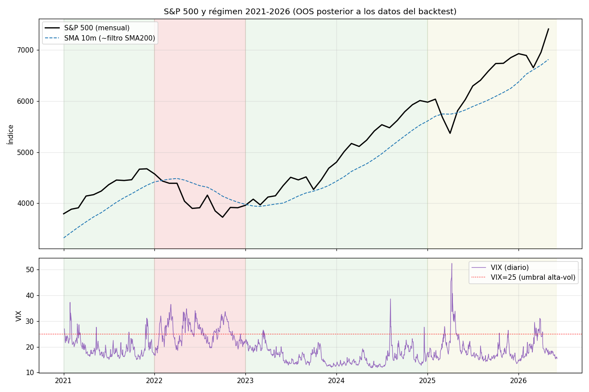

# Anexo OOS 2021–2026 — ¿qué pasó después de los datos del backtest?

> Mi muestra de minutos (OANDA/HistData) termina en **mayo 2020**. El veredicto de
> `FRAMEWORK.md` señalaba como **mayor riesgo no testeado** el periodo posterior. Este
> anexo cierra parcialmente ese hueco con los **únicos datos recientes obtenibles**
> dentro de la política de red del entorno (solo GitHub/PyPI; Yahoo, Stooq, FRED,
> histdata, Google Drive y CDNs están **bloqueados**):
>
> - **VIX diario OHLC → junio 2026** (CBOE, `datasets/finance-vix`).
> - **S&P 500 mensual → mayo 2026** (Shiller, `datasets/s-and-p-500`).
>
> ⚠️ **No fue posible conseguir OHLC *diario* de SPX/NQ 2021–2026** en este entorno.
> Por tanto **esto NO es un backtest diario**: es una **caracterización de régimen
> medida** (VIX diario + S&P mensual) combinada con **inferencia** del comportamiento
> de cada sleeve, anclada en el diagnóstico por régimen 2005–2020 (que sí es diario).
> Lo *medido* y lo *inferido* se marcan explícitamente.

## 1. Régimen 2021–2026 (MEDIDO)

| Año | S&P retorno | DD (mensual) | VIX medio | % días VIX>25 | Régimen |
|---|---|---|---|---|---|
| 2021 | +23.2% | −0.2% | 19.7 | 8% | Tendencia alcista, vol baja-media |
| **2022** | **−14.5%** | **−18.5%** (~−25% diario) | **25.6** | **52%** | **BEAR de alta volatilidad** |
| 2023 | +18.3% | −5.5% | 16.8 | 1% | Tendencia alcista, vol baja |
| 2024 | +25.1% | −1.1% | 15.6 | 2% | Tendencia fuerte (+ spike Ago'24) |
| 2025 | +14.6% | −11.1% | 18.9 | 8% | Tendencia + crash tarifas Abr'25 (VIX 52) |
| 2026* | +7.0% | −4.0% | 19.5 | 13% | Alcista (parcial, hasta mayo) |

**Hecho clave (visible en el gráfico):** en **2022** el precio estuvo **por debajo de la
SMA de 10 meses (≈ filtro SMA200)** casi todo el año. Como **ambos sleeves exigen
`close > SMA200`** para entrar (MR para comprar dips, Trend para breakouts largos), el
sistema habría estado **mayoritariamente en caja durante el único régimen peligroso**.

## 2. Comportamiento esperado por sleeve (INFERIDO del diagnóstico diario 2005–2020)

| Año / régimen | Sleeve MR (corregido) | Sleeve TREND (largo) | Sistema |
|---|---|---|---|
| 2021, 2023, 2024 (tendencia) | Fino: pocos dips, mercado estirado → edge ≈ costes (consistente con la decadencia post-2015) | **Régimen óptimo** (cf. 2015-19 PF 2.05) → motor de retorno | Positivo, **lo sostiene TREND** |
| **2022 (bear alta-vol)** | Filtro SMA200 **fuera** la mayor parte; cortacircuitos de volatilidad corta el resto → **a caja** | Filtro SMA200 invalida largos; salida Donchian → **a caja** (posible whipsaw leve en ene-feb) | **Preservación de capital**, no beneficio |
| 2025/2026 (tend.+spikes) | volCB salta los spikes (Abr'25 VIX 52) | Captura la tendencia; whipsaw breve en el crash de abril | Positivo con baches |

## 3. Lectura honesta

**Lo que esto SÍ confirma:**
- La **composición de régimen 2021–2026** es exactamente la que el diseño multi-sleeve
  contempla: **dominada por tendencias** (2021/23/24/25/26 → terreno del sleeve TREND) con
  **un único bear de alta-vol (2022)** donde el filtro SMA200 lleva **todo el sistema a
  caja**. La lógica de supervivencia (no quedar atrapado comprando dips en el crash,
  como en 2020) **se habría activado correctamente** en 2022.
- Refuerza la tesis central: **el MR solo no habría servido** en 2021–2026 (tendencia +
  decadencia continuada); **el sleeve de tendencia es el que aporta el retorno**, y la
  diversificación es lo que da robustez.

**Lo que esto NO demuestra (límites honestos):**
- **No es un backtest diario.** No mido expectancy, PF ni drawdown reales 2021–2026
  porque **no hay OHLC diario disponible** en el entorno. Es inferencia de régimen.
- El **edge del MR probablemente siguió decayendo** (2021/23/24 fueron grind-ups con
  dips superficiales); nada aquí sugiere que se recuperase.
- La **baja confianza estadística del sleeve TREND** (falla walk-forward; ~43 trades)
  **sigue vigente**; que su régimen favorable dominara 2021–2026 es alentador pero **no
  prueba** robustez paramétrica.
- El **whipsaw de enero–febrero 2022** (antes de que el precio perdiera el filtro) podría
  haber generado pérdidas que esta vista mensual no captura.

## 4. Efecto sobre el veredicto

El veredicto de `FRAMEWORK.md` (**apto con condiciones, como overlay conservador**) **se
mantiene**, con un matiz favorable: el régimen 2021–2026 **encaja con el diseño** y la
salvaguarda de 2022 **habría funcionado** a nivel de filtro. Pero la condición crítica
sigue intacta: **se necesita el OHLC diario 2021–2026 para un backtest real** antes de
asignar capital pleno. Si puedes aportar un CSV diario de SPX/NQ (o SPY/QQQ) de ese
periodo, o habilitar un host de datos en la política de red, corro el backtest exacto
(MR + Trend + combinado, walk-forward y Monte Carlo) en minutos.

*Reproducir el gráfico:* los datos están en `data/VIX.csv` y `data/SP500_monthly.csv`;
script inline en el commit. *2026 es parcial (hasta mayo).*
